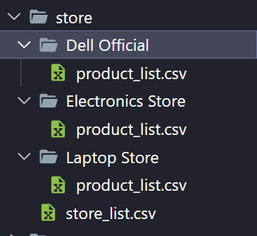

# CSC10003 - Final Lab Exam Report

> **Note:** This report is written in Markdown format. To view the report in Markdown format, please use Markdown editor such as [Typora](https://typora.io/) or [Visual Studio Code](https://code.visualstudio.com/) with [Markdown Preview Enhanced](https://marketplace.visualstudio.com/items?itemName=shd101wyy.markdown-preview-enhanced) extension.

## Table of Contents

- [Table of Contents](#table-of-contents)
- [1. Introduction](#1-introduction)
- [2. System Architecture](#2-system-architecture)
  - [2.1 System Overview](#21-system-overview)
    - [2.1.1 Source structure](#211-source-structure)
    - [2.1.2 Data storage system](#212-data-storage-system)
  - [2.2 UML Class Diagram](#22-uml-class-diagram)
  - [2.3 Design Patterns](#23-design-patterns)
    - [2.3.1 Singleton Pattern](#231-singleton-pattern)
    - [2.3.2 Factory Method Pattern](#232-factory-method-pattern)
    - [2.3.3 Builder Pattern](#233-builder-pattern)
    - [2.3.4 Strategy Pattern](#234-strategy-pattern)
    - [2.3.5 Observer Pattern](#235-observer-pattern)
    - [2.3.6 Composite Pattern](#236-composite-pattern)
    - [2.3.7 Iterator Pattern](#237-iterator-pattern)
    - [2.3.8 State Pattern](#238-state-pattern)
- [3. Bonus Features](#3-bonus-features)
  - [3.1 Review and Rating Product](#31-review-and-rating-product)
  - [3.2 LiveStream Product](#32-livestream-product)

## 1. Introduction

**Student ID:** 22127154

**Student Name:** Nguyen Gia Huy

My work history in this project:

- [Part 1](https://github.com/HZeroxium/OOP_Group04)
- [Part 2](https://github.com/HZeroxium/OOP_Final)

## 2. System Architecture

### 2.1 System Overview

#### 2.1.1 Source structure

- `cFileName.h` & `cFileName.cpp`: contain normal class
- `iFileName.h` & `cFileName.cpp`: usually contain interface with design pattern implementation
- `uFileName.h` & `uFileName.cpp`: contain utility class or namespace

#### 2.1.2 Data storage system

All data is saved in `data` folder. The data is saved in `txt` or `csv` format. The data is loaded and saved by `DataManager` class.

##### A. `discount_code` folder

Contain `discount_code_list.csv` that contain discount code data in csv format.


##### B. `product` folder

Contain `product_list.csv` that contain product data in csv format and `category_list.txt` that contain product category data in txt format.


##### C. `store` folder

Contain `store_list.csv` that contain store data in csv format, each store has its own folder that contain `product_list.csv` that contain product data in csv format.




##### D. `user` folder

Contain `user_list.csv` that contain user data in csv format and `customer` folder that contains many folder for each `Customer` and each `customer` folder contain several `*order.txt` store order history and one `shopping_cart.txt` store shopping cart data.


### 2.2 UML Class Diagram


### 2.3 Design Patterns

#### 2.3.1 Singleton Pattern

Singleton pattern is used for class that only need to be instantiated once such as:

- `DataManager` class: provide data for the application, load data from file and save data to file
- `DataConverter` class: convert data from one format to another format.
- `DataStorageSystem` class: provide static methods to manage file and folder.
- `ConsoleDecorator` class: provide static methods to decorate console output.
- `UserManager` class: manage user data and provide methods to login, logout, register, etc.
- `Console` class: provide interface to interact with user via `ConsoleState` class.

#### 2.3.2 Factory Method Pattern

Factory method pattern is used to create object of different types based on the input such as:

- `PaymentMethodFactory` class: create `PaymentMethod` object for an `Order`. It has concrete classes such as `CreditCardPaymentMethodFactory`, `MomoPaymentMethodFactory` to create `CreditCardPaymentMethod` and `MomoPaymentMethod` object respectively.

#### 2.3.3 Builder Pattern

Builder pattern is used to create complex object step by step. In this application, it is used to create `Product` object from `ProductBuilder` class.

`ProductBuilder` class has concrete class `ConcreteProductBuilder` to create `Product` object. It is managed by `ProductDirector` class.

#### 2.3.4 Strategy Pattern

Strategy pattern is used to change the behavior of an object at runtime such as:

- `PaymentMethod` class: provide interface for payment method. It has concrete classes such as `CreditCardPaymentMethod`, `MomoPaymentMethod` to implement payment method.
- `ShippingStrategy` class: provide interface for shipping strategy. It has concrete classes such as `StandardShippingStrategy`, `ExpressShippingStrategy` to implement shipping strategy.
- `DiscountCode` class: provide interface for discount strategy. It has concrete classes such as `OverallDiscountCode`, `CategoryDiscountCode` and `BirthdayDiscountCode` to implement discount strategy.
- `CustomerRank` class: provide interface for customer rank strategy. It has concrete classes such as `RegularCustomerRank`, `BronzeCustomerrank`, `SilverCustomerRank`, `GoldCustomerRank` to implement customer rank strategy.

#### 2.3.5 Observer Pattern

Observer pattern is used to notify the change of an object to other objects. In this project, for flash sale feature, `FlashSale` class is the subject implement `Subject` interface and `Product` class is the observer implement `Observer` interface.

#### 2.3.6 Composite Pattern

Composite pattern is used to treat a group of objects the same way as a single object. In this project, `CompositeProductCategory` class is the composite class and `LeafProductCategory` class is the leaf class implement `ProductCategory` interface.

#### 2.3.7 Iterator Pattern

Iterator pattern is used to traverse a container and access the container's elements. In this project, `ShoppingCartIterator` class implement `ProductIterator` interface to traverse `ShoppingCart` class implement `ProductCollection` interface.

#### 2.3.8 State Pattern

State pattern is used to change the behavior of an object based on its state such as:

- `OrderState` class: provide interface for order state. It has concrete classes such as`ProcessingOrderState`, `ShippingOrderState`, `DeliveredOrderState` and `CanceledOrderState` to implement order state.

**Special:** `ConsoleState` class is used to change the behavior of `Console` context class based on its state.

**State Diagram:**


## 3. Bonus Features

### 3.1 Review and Rating Product

For each product, customer can review and rate it. The review and rating will be saved in `data/product/productID/review.txt` file.

For implementation, `Product` class has `vector<Review>` attribute to store review and rating. `Review` class has `unsigned int rating;` and `string comment;` attribute to store rating and comment.

For asynchronized feature, `DataConverter` add new method `convertReviewToString` and `convertStringToReview` to convert `Review` object to string and vice versa.

Then, `DataManager` add new method `saveReview` and `loadReview` to save and load review data of a product from file.

In `Console` class, `ProductState` add new method `reviewProduct` to allow customer review and rate product.

### 3.2 LiveStream Product

For this feature, I extend `User` class to `StoreOwner` class. `StoreOwner` class has `vector<LiveStream> liveStreams;` attribute to store live stream data.

```cpp

class LiveStream {
    private:
        string title;
        string description;
        string url;
        Time startTime;
        Time endTime;
        unsigned int viewCount;
        unsigned int likeCount;
        unsigned int dislikeCount;
        vector<Comment> comments;
    public:
};

class StoreOwner : public User {
private:
    vector<LiveStream> liveStreams;
public:
    void startALiveStream();
};
```

For asynchronized feature, `DataConverter` add new method `convertLiveStreamToString` and `convertStringToLiveStream` to convert `LiveStream` object to string and vice versa.

Then, `DataManager` add new method `saveLiveStream` and `loadLiveStream` to save and load live stream data of a store from file.

In `Console` class, add new `LiveStreamState` class to allow store owner start a live stream and view live stream of a store.

For `Customer` class, it can view live stream of a store, comment and buy product on it via join live stream feature through `Console` class. It will redirect from `HomeState` to `LiveStreamState`.
